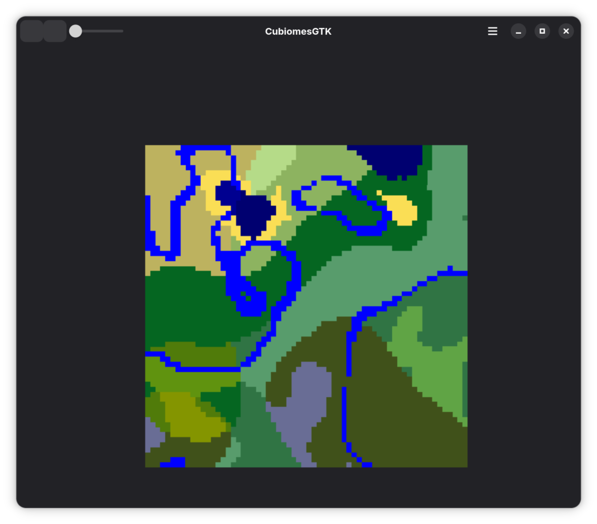

# WIP! mine_gen
Test environment for learning and implementing minecraft biome generation algorithm

This repository contains:
- cubiomes - rust crate with safe bindings of https://github.com/Cubitect/cubiomes library
- cubiomes-gtk - interactive gui for cubiomes powered by gtk4 and libadwaita
- cubiomes-sys - rust crate with unsafe bindings of cubiomes
- yarn - minecraft mappings for development

# Build
Clone repo with submodules
For cubiomes lib use `cargo build --lib -p cubiomes` and test with `cargo test --lib -p cubiomes` same as cubiomes-sys

For cubiomes-gtk use:
- `cargo build -p cubiomes-gtk` but compile glib-resources itself
- Meson build system
  - `meson setup _build`
  - `meson compile -C _build`
  - `meson install -C _build`

# Wip GUI

